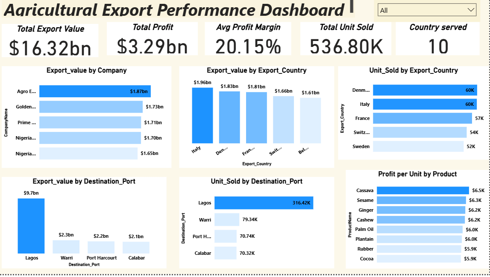
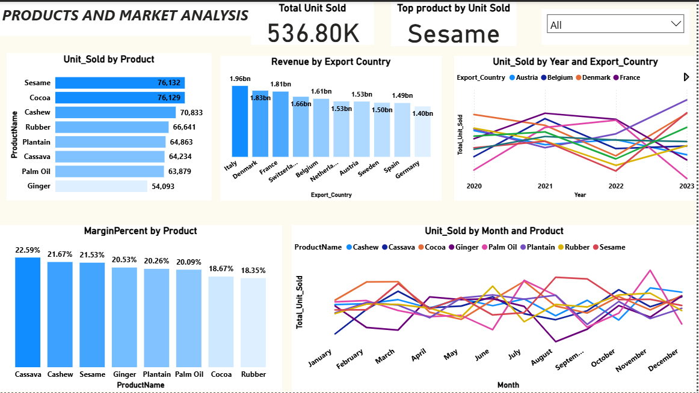

# Agricultural-export-analysis
Comprehensive agricultural export analytics and dashboard project showcasing product performance, seasonal demand trends, profitability insights, and market diversification across 10 countries. Includes executive summaries, visual dashboards, and strategic recommendations for growth, risk management, and logistics optimization.

# Agricultural Export Executive Summary

## 📊 Key Performance Indicators
- **Total Export Value (Revenue):** $16.32bn  
- **Total Units Sold:** 536.8K  
- **Average Profit Margin:** 20.15%  
- **Countries Served:** 10  
- **Top Product by Units Sold:** Sesame (76K units)  
- **Top Product by Margin:** Cassava (22.6%, profit per unit $6.5K)  

## 🔎 Insights

### Products
- Sesame drives demand; Cocoa is close behind.  
- Cassava leads profitability, while Cocoa and Rubber lag in margins.  

**Seasonal Peak:**  
- Early uptick in March for Cocoa, Sesame, and Cassava → targeted campaigns.  
- Broad, cross‑product peak in June → main season to prepare.  

**Stable Demand:**  
- September–December demand is steady → predictable planning.  

### Markets
- Revenues balanced across countries (1.4–2.0bn) → diversified portfolio.  
- Italy, Denmark, France are top destinations by value.  
- Austria & Belgium show growth; France & Germany show decline.  

### Logistics
- Lagos dominates exports (59% of units, $9.7bn) → concentration risk.  
- Warri, Port Harcourt, Calabar underutilized.  

### Companies
- Top exporters (Agro Export Nigeria Ltd, Golden Farm Nigeria Ltd, Prime Agro Export) contribute $1.7–1.9bn each.  
- Others remain competitive but slightly behind.  

### Export Trends (2020–2023)
- **Growth Leaders:** Italy, Spain, Switzerland  
- **Stable/Resilient:** Denmark, Austria, Belgium, Sweden  
- **Declining Risks:** France, Germany  
- **Volatile but Recovering:** Netherlands  

## 🚀 Opportunities
1. Expand growth markets (Austria & Belgium).  
2. Leverage profit leaders (Cassava).  
3. Diversify logistics (reduce Lagos dependency).  

## ⚠️ Risks
1. Declining destinations (France, Germany).  
2. Margin pressure (Cocoa, Rubber).  
3. Port concentration risk (Lagos).  

## 📌 Recommendations
- Balance demand vs. profitability (Sesame vs. Cassava).  
- Revive declining markets (France, Germany).  
- Optimize product portfolio (improve Cocoa & Rubber margins).  
- Mitigate logistics risk (invest in secondary ports).  
- Support leading exporters (expand reach, maintain competitiveness).  

 **👉  Overall Summary**: 

Agricultural exports are diversified across 10 countries with balanced revenues, but logistics are heavily concentrated in Lagos. Sesame drives demand, Cassava drives profitability, while Austria & Belgium are growth markets and France & Germany are declining. Strategic focus should be on balancing product mix, expanding growth destinations, mitigating port dependency, and improving margins for weaker products.

## 📊 Dashboard Snapshot

📸 **Agricultural Export Dashboard (PDF Export)**

## 📊 Dashboard Snapshot

📸 **Agricultural Export Dashboard**

## 📊 Dashboard Snapshot

📸 **Agricultural Export Dashboard 2**

